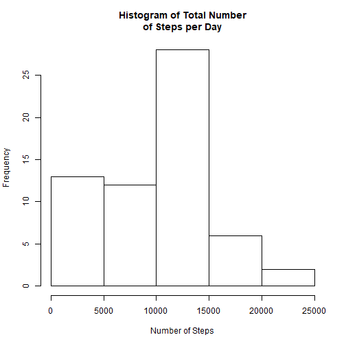
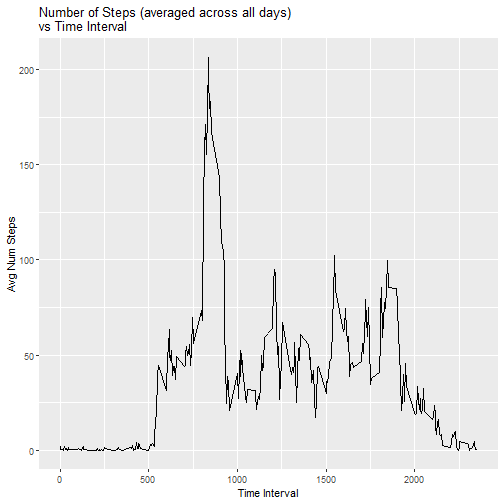
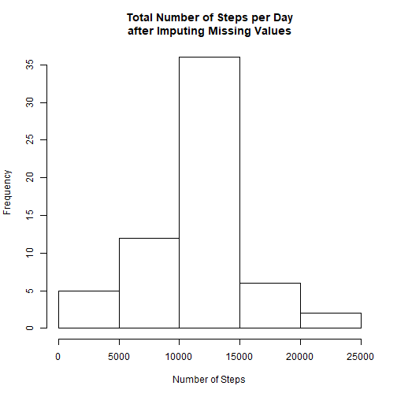
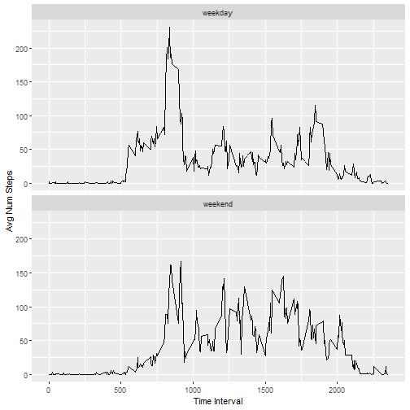

<br>
  
## Introduction:
This project analyzes data from a personal activity monitoring device. The device collects data at 5 minute intervals throughout the day for 2 months. The data file name is 'activity.csv' saved in the zip file 'activity.zip'. The variables in the dataset are:  
- **steps:** Num of steps taken in a 5-min interval (missing vals are 'NA')  
- **date:** The date of the measurement (YYYY-MM-DD)  
- **interval:** Identifier for the 5-min interval (e.g., 0,5,10,15)  


<br>
  
## Setup:

```r
knitr::opts_chunk$set(echo = TRUE)
library(readr)
library(ggplot2)
suppressPackageStartupMessages(library(dplyr))
```


<br>
  
## Loading and preprocessing the data

```r
data <- read_csv('activity.zip')
```

```
## Parsed with column specification:
## cols(
##   steps = col_integer(),
##   date = col_date(format = ""),
##   interval = col_integer()
## )
```


<br>
  
## What is mean total number of steps taken per day?
<br>
  
1.) Calculate the total number of steps taken per day  

```r
nStepsByDate <- data %>% 
    group_by(date) %>%
    summarize(sum(steps, na.rm=T))
names(nStepsByDate) <- c('date','nSteps')
```
<br>
  
2.) Plot a histogram of the total num of steps taken each day  

```r
hist(nStepsByDate$nSteps, main='Histogram of Total Number\nof Steps per Day',
     xlab='Number of Steps')
```


<br>
  
3.) Calculate the mean and median of the total num of steps per day  

```r
meanStepsByDate <- mean(nStepsByDate$nSteps, na.rm=T)
medianStepsByDate <- median(nStepsByDate$nSteps, na.rm=T)
cat('  Mean = ', meanStepsByDate, '\nMedian = ', medianStepsByDate)
```

```
##   Mean =  9354.23 
## Median =  10395
```


<br>
  
## What is the average daily activity pattern?
<br>
  
1.) Make a time series plot of nSteps (avg'ed across all days) vs the 5-min intervals  

```r
nStepsByInterval <- data %>%
    group_by(interval) %>%
    summarize(avgNumSteps=mean(steps, na.rm=T)) %>%
    mutate(intNumSteps=as.integer(round(avgNumSteps)))
qplot(interval, avgNumSteps, data=nStepsByInterval,
      main='Number of Steps (averaged across all days)\nvs Time Interval', 
      xlab='Time Interval', ylab='Avg Num Steps', geom='line')
```


<br>
  
2.) Which 5-min interval (on avg across all days) contains the max nDays?  

```r
maxIntervalIndex <- with(nStepsByInterval, which(avgNumSteps==max(avgNumSteps)))
message(paste(capture.output({cat('\n5-min interval with max avg num of days:\n') 
                             print(nStepsByInterval[maxIntervalIndex,])
                             }), collapse='\n'))
```

```
## 
## 5-min interval with max avg num of days:
## # A tibble: 1 x 3
##   interval avgNumSteps intNumSteps
##      <int>       <dbl>       <int>
## 1      835        206.         206
```
- The average daily activity pattern follows the times series plot above.  
-- The average number of steps per 5-min time interval hovers around 50 steps.  
-- There are 3 increases to about 100 steps at approximately 1200hrs, 1530 hrs, and 1800hrs.  
-- There is a single spike of over 200 steps at 0835hrs.  


<br>
  
## Imputing missing values
<br>
  
1.) Calculate the total number of missing values in the dataset  

```r
nNA <- sum(is.na(data))
cat('Total number of NAs:', nNA)
```

```
## Total number of NAs: 2304
```
<br>
  
2.) Devise a strategy for filling in the missing data in the dataset  
-- Replace all NAs with the mean for that 5-min interval. 
  (These mean values were saved to nStepsByInterval)  
<br>
  
3.) Create a new dataset that is equal to the original dataset
    but with the missing data filled in.  

```r
# Copy dataset
newData <- data

# Get indices of NA entries
idx <- which(is.na(newData$steps))

# Replace NA step entries with the mean step entries found in nStepsByInterval
for (i in idx) {
    newData$steps[i] <- nStepsByInterval$intNumSteps[nStepsByInterval$interval==newData$interval[i]]
}

# Check result
cat('Total number of NAs in new dataset:', sum(is.na(newData)))
```

```
## Total number of NAs in new dataset: 0
```
<br>
  
4.) Redo the first part of the assignment (ignoring NAs) and compare to 
    new data (with NAs filled in).  

```r
# Calculate the total number of steps taken per day
nStepsByDate_new <- newData %>%
    group_by(date) %>%
    summarize(sum(steps, na.rm=T))
names(nStepsByDate_new) <- c('date','nSteps')

# Plot a histogram of the total num of steps taken each day
hist(nStepsByDate_new$nSteps, main='Total Number of Steps per Day\nafter Imputing Missing Values',
     xlab='Number of Steps')
```



```r
# Calculate the mean and median of the total num of steps per day
meanStepsByDate_new <- mean(nStepsByDate_new$nSteps, na.rm=T)
medianStepsByDate_new <- median(nStepsByDate_new$nSteps, na.rm=T)
cat('  Mean (after imputing) = ', meanStepsByDate_new, '\nMedian (after imputing) = ', medianStepsByDate_new)
```

```
##   Mean (after imputing) =  10765.64 
## Median (after imputing) =  10762
```
<br>
  
- Is there a difference? What is the impact of imputing missing data on the estimates of the total daily number of steps?  
-- Both the mean and median of the new dataset are higher than those of the original dataset.  
-- The mean and median of the new dataset are much closer together than in the original dataset (almost identical).  
-- From visual inspection, the histogram of the new dataset is more normally distributed.  


<br>
  
## Are there differences in activity patterns between weekdays and weekends?
<br>
  
1.)  Create a new factor variable in the dataset with two levels indicating whether a given date is a weekday or a weekend.  

```r
weekendNames <- c('Saturday','Sunday')
nStepsByInterval_new <- newData %>%
    mutate(dayCat=factor(weekdays(date) %in% weekendNames, labels=c('weekday','weekend'))) %>%
    group_by(dayCat,interval) %>%
    summarize(avgNumSteps=mean(steps, na.rm=T)) %>%
    mutate(intNumSteps=as.integer(round(avgNumSteps)))
```
<br>
  
2.) Make a panel plot containing time series plots of the number of steps, averaged across all weekday days or weekend days, vs the 5-minute time interval.  

```r
qplot(interval, avgNumSteps, data=nStepsByInterval_new, xlab='Time Interval', 
      ylab='Avg Num Steps', geom='line') + facet_wrap(~ dayCat,ncol=1)
```


<br>
  
- Are there differences between the weekdays and weekends?  
-- The spike at 0835hrs is still present in the weekday data.  There is a double-peak at about the same time on the weekends, but not as large a number of steps.  
-- It appears that before approximately 1000hrs, the number of steps, averaged across all weekday days is higher.  
-- Above approximately 1000hrs, the number of steps, averaged across all weekend days is higher, until approx 2100hrs.  
-- Bottom line: People seem to walk a more consistent average number of steps throughout the day on the weekends, while there are a higher average number of steps before 0900hrs on weekdays.  

